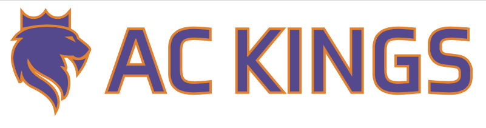
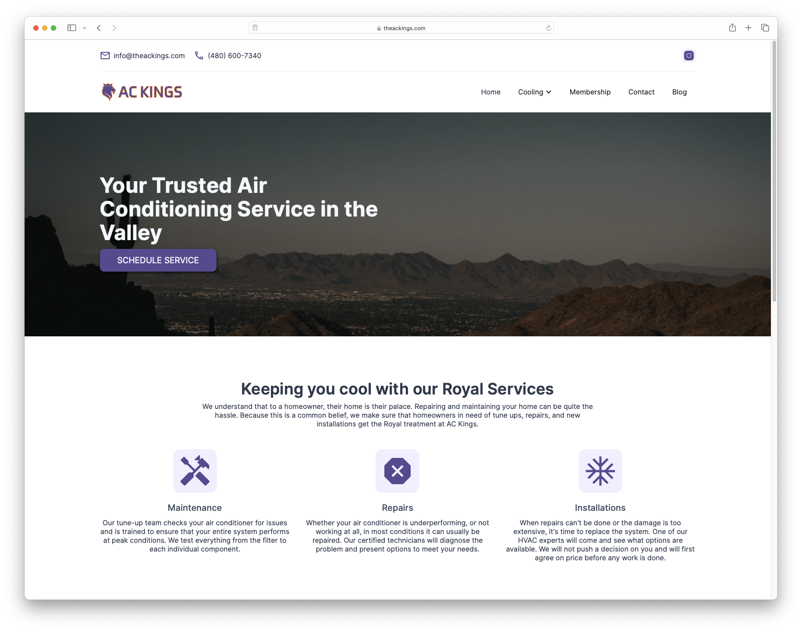
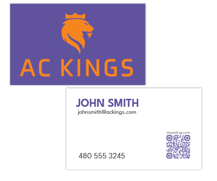

## The Challenge

AC Kings was launching as a new HVAC company in the competitive Phoenix market with a clear vision: to provide royal treatment and exceptional service to every customer. They needed a complete brand identity and digital presence that would communicate their premium positioning and differentiate them from typical HVAC contractors.

Key requirements included:

- Professional brand identity with a "royal" theme
- Modern, high-converting website
- Complete messaging and copywriting
- Print materials for local marketing
- Professional appearance from day one

## Our Solution

We delivered a comprehensive branding and web design package that perfectly captures AC Kings' royal service approach and professional expertise.

### Royal Brand Identity

Designed a distinctive logo and brand identity centered around the "Kings" theme that stands out in the HVAC industry.

The logo incorporates crown elements with a professional color palette of deep blues and golds. We created comprehensive brand guidelines to ensure consistent application across all touchpoints, from the website to business cards to vehicle wraps.

**Brand Identity Deliverables:**

- Professional logo with multiple variations
- Royal color palette (blues and golds)
- Typography guidelines
- Brand usage standards
- Visual identity system

### Modern Webflow Website

Built a stunning, high-performance website using Webflow that communicates professionalism and generates leads.

**Website Features:**

- **Visual Design** - Clean, modern layout that builds trust
- **Responsive Design** - Perfect experience across all devices
- **Service Showcases** - Detailed pages for AC repair, installation, and maintenance
- **Fast Performance** - Lightning-fast loading speeds
- **Easy Updates** - Simple CMS for content management
- **Lead Generation** - Strategic contact forms and calls-to-action

The site effectively communicates their "royal service" positioning while making it easy for customers to request service and learn about their offerings.

### Professional Copywriting

Crafted compelling messaging throughout the site that converts visitors into customers:

- Engaging homepage communicating their royal service approach
- Detailed service descriptions highlighting expertise
- Persuasive calls-to-action
- SEO-optimized content for local search visibility
- Trust-building about page

Every word was chosen to reinforce their premium positioning while remaining approachable and customer-focused.

### Business Card Design

Created professional business cards that extend the brand identity and make lasting impressions.

The cards feature:

- Consistent branding with logo and royal colors
- High-quality design for professional networking
- Clear contact information
- Premium paper stock recommendation

### Analytics & Conversion Tracking

Implemented a comprehensive tracking system to measure success:

- **Google Analytics 4** for website performance monitoring
- **Google Tag Manager** for flexible tracking
- **Phone Call Tracking** to measure lead sources
- **Form Submission Monitoring** for conversion optimization
- **Custom Conversion Goals** aligned with business objectives

This data-driven approach allows AC Kings to continuously optimize their marketing and understand which channels drive the most valuable leads.

## The Results

AC Kings launched with a premium brand identity and professional website that immediately positions them as a top-tier HVAC provider in Phoenix. The royal theme successfully differentiates them in a crowded market while the website effectively converts visitors into customers.

**Project Highlights:**

- Distinctive "royal" brand identity that stands out
- High-performance Webflow website with exceptional design
- Complete suite of marketing materials
- 100% custom copywriting optimized for conversions
- Professional business cards for local networking
- Full analytics and tracking implementation

## Technologies Used

- **Webflow** - CMS & Hosting
- **Google Analytics 4** - Performance tracking
- **Google Tag Manager** - Flexible analytics
- **Responsive Design** - Mobile-first approach
- **SEO Optimization** - Local search visibility

## Project Timeline

- **Week 1-2:** Brand strategy, logo design, and website wireframes
- **Week 3-4:** Webflow development and content creation
- **Week 5:** Business card design and analytics setup
- **Week 6:** Testing, refinements, and launch

## Ongoing Partnership

We continue to support AC Kings with:

- Website content updates
- Performance optimization
- Technical support
- Design refinements as needed
- Monthly analytics reporting

## Conclusion

This project showcases how strategic branding combined with modern web design can successfully launch a premium service business. The royal theme creates instant differentiation in the HVAC market while the professional execution establishes credibility.

By providing everything from logo design to business cards to ongoing support, we gave AC Kings a complete marketing foundation that supports their growth and helps them attract premium customers who appreciate exceptional service.

The Webflow platform provides them with a fast, beautiful website that's easy to update, while the comprehensive analytics setup allows them to track performance and continuously improve their marketing efforts.
