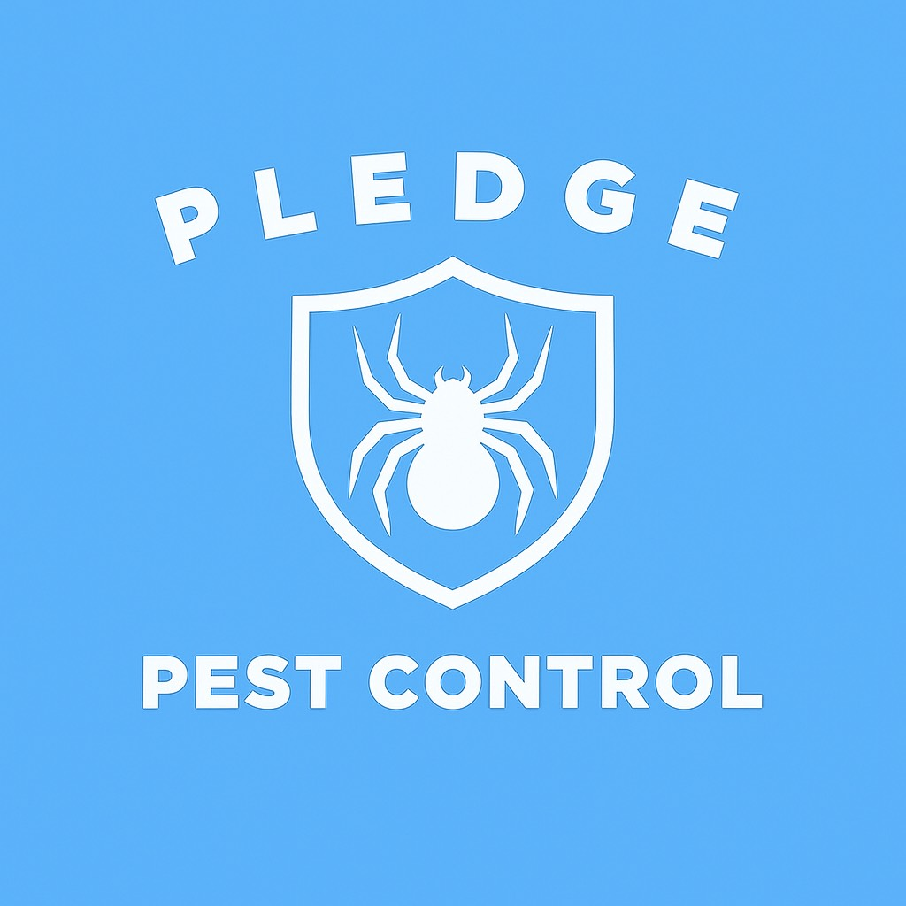
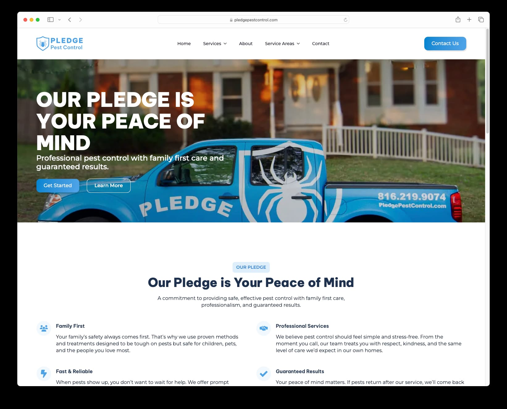

## The Challenge

Pledge Pest Control was a brand new family-owned business entering the competitive Phoenix pest control market. They needed a complete digital presence from scratch—a professional brand identity and website that would establish credibility and communicate their unique value proposition.

Key challenges included:

- No existing brand identity or logo
- Completely new business with no online presence
- Need to differentiate in a crowded market
- Limited content and messaging

## Our Solution

We provided a comprehensive branding and web design package that gave Pledge Pest Control everything they needed to launch successfully.

### Brand Design & Logo

Created a professional logo that reflects their family values and commitment to safe pest control. The design communicates trust, reliability, and their family-friendly approach to pest management.

### Custom WordPress Website

Built a fully custom WordPress theme tailored specifically to their business needs:

- **Clean, Professional Design** - Modern layout that builds immediate trust with visitors
- **Mobile-First Approach** - Perfect experience on all devices
- **Service Pages** - Detailed pages for each pest control service offered
- **Fast Performance** - Optimized for quick loading and search engine visibility

### Complete Copywriting

Wrote all website content from scratch, including compelling homepage messaging, detailed service descriptions, and SEO-optimized content for local search visibility.

## The Results

Pledge Pest Control launched with a professional digital presence that immediately established credibility in their market. The website successfully communicates their family-friendly approach and commitment to safe pest control services.

**Project Highlights:**

- Complete brand identity from concept to launch
- Fully custom WordPress theme
- 100% original, SEO-optimized content
- Mobile-responsive design
- Comprehensive analytics tracking

## Technologies Used

- WordPress (Custom Theme Development)
- PHP & MySQL
- HTML5, CSS3, JavaScript
- Google Analytics 4
- Google Tag Manager

## Conclusion

This project demonstrates how a complete branding and web design solution can successfully launch a new business in a competitive market. By handling everything from logo design to copywriting to ongoing support, we gave Pledge Pest Control a strong foundation for growth.
